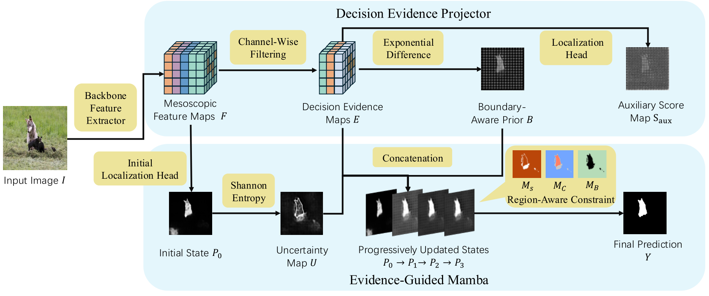
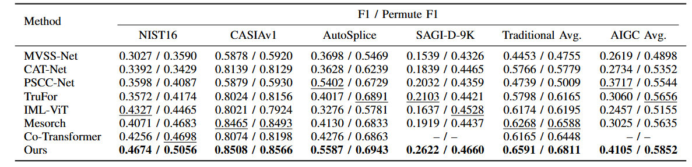

# Progressive Decision-Making for Localizing Open-Ended AI-Generated Image Forgeries

This repository contains the official PyTorch implementation of:

**Progressive Decision-Making for Localizing Open-Ended AI-Generated Image Forgeries**

This work proposes a progressive decision-making framework for pixel-level localization of open-ended AI-generated image forgeries. The proposed method progressively refines localization states through evidence-guided refinement, improving robustness under both traditional and AI-generated manipulation scenarios.

The code is developed based on the IMDLBenCo and Mesorch frameworks.

---

## Framework

<p align="center">

</p>

The proposed framework contains two main components:

- **Decision Evidence Projector**: extracts manipulation-related evidence from mesoscopic features and generates boundary-aware prior information.
- **Evidence-Guided Mamba**: progressively updates localization states through evidence-guided refinement.

The localization process is gradually refined from the initial state to the final prediction.

---

## Main Results

<p align="center">

</p>

The proposed method achieves competitive performance on both traditional manipulation datasets and AI-generated manipulation datasets.

---

## Environment

The experiments are conducted based on the IMDLBenCo framework.

A typical environment setup is:

```bash
conda create -n mesorch python=3.10
conda activate mesorch

pip install torch torchvision
pip install imdlbenco
pip install "numpy<2"
```

Additional dependencies for the proposed module:

```bash
pip install mamba-ssm causal-conv1d
```

Other common dependencies can be installed according to the requirements of IMDLBenCo.

---

## Dataset Preparation

The dataset paths are configured through JSON files:

```text
balanced_dataset1.json      # Protocol I training
balanced_dataset2.json      # Protocol II training

test_dataset1.json          # Protocol I testing
test_dataset2.json          # Protocol II testing
```

Please modify the dataset paths in these files according to your local environment.

---

## Training

### Protocol I

```bash
sh finetune_protocol1.sh
```

### Protocol II

```bash
sh finetune_protocol2.sh
```

Before training, please configure the dataset paths, pretrained weights, and output directories in the corresponding scripts.

---

## Testing

### Standard F1

```bash
sh test_mesorch_f1.sh
```

### Permute F1

```bash
sh test_mesorch_pf1.sh
```

Modify the checkpoint path and test dataset configuration before evaluation.

---

## File Structure

```text
.
├── progressive_mesorch.py
├── train.py
├── test.py
├── balanced_dataset1.json
├── balanced_dataset2.json
├── test_dataset1.json
├── test_dataset2.json
├── finetune_protocol1.sh
├── finetune_protocol2.sh
├── test_mesorch_f1.sh
├── test_mesorch_pf1.sh
├── images/
│   ├── framework.png
│   └── main_results.png
├── LICENSE
└── README.md
```

---

## Citation

If you find this work useful, please consider citing our paper:

```bibtex
@article{hou2026progressive,
  title={Progressive Decision-Making for Localizing Open-Ended AI-Generated Image Forgeries},
  author={Hou, Jingyi and Chen, Xiaoxia and Zhou, Leyu and Wang, Zhichuang and Liu, Zhijie},
  journal={arXiv preprint arXiv:XXXX.XXXXX},
  year={2026}
}
```

---

## License

This project is released under the MIT License.
